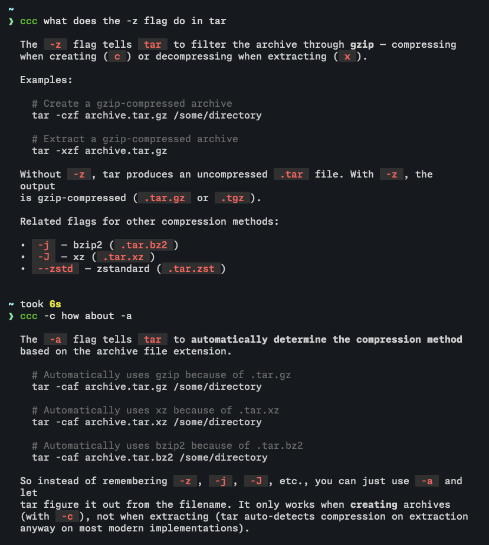

# ccc

Quick questions for Claude, right from your terminal.

```bash
ccc "what does the -z flag do in tar"
```



## Install

### Homebrew

```bash
brew install sadjad/tap/ccc
```

### Manual

```bash
git clone https://github.com/sadjad/ccc.git
ln -s "$(pwd)/ccc/ccc" /usr/local/bin/ccc
```

### Dependencies

- [Claude Code](https://claude.ai/claude-code) (`claude`)
- [glow](https://github.com/charmbracelet/glow) (`brew install glow`)

## Usage

```bash
# Ask anything (quotes are optional)
ccc what is the best way to handle errors in Go
ccc "what does the -z flag do in tar"

# Interactive mode: just run ccc with no prompt
# Follow-ups automatically continue the conversation
ccc
# ccc> what is rust?
# ccc> tell me more about ownership

# Pipe in code, diffs, logs
git diff | ccc review this
cat main.py | ccc explain this

# Pick a model (default: opus)
ccc --model haiku what is 2+2

# Give Claude access to a directory
ccc --dir ./src explain the architecture

# Copy output to clipboard
ccc --yank write a bash one-liner to find large files

# Continue a previous conversation
ccc what is rust
ccc --continue what about ownership
```

### Options

| Short | Long | Description |
|-------|------|-------------|
| `-c` | `--continue` | Continue the most recent conversation |
| `-m` | `--model <model>` | Model to use (default: opus) |
| `-d` | `--dir <dir>` | Add directory context for file access |
| `-y` | `--yank` | Copy raw output to clipboard |
| `-h` | `--help` | Show help message |
| `-v` | `--version` | Show version |

Long options that take a value also accept `=` syntax (e.g., `--model=haiku`).

## License

MIT
