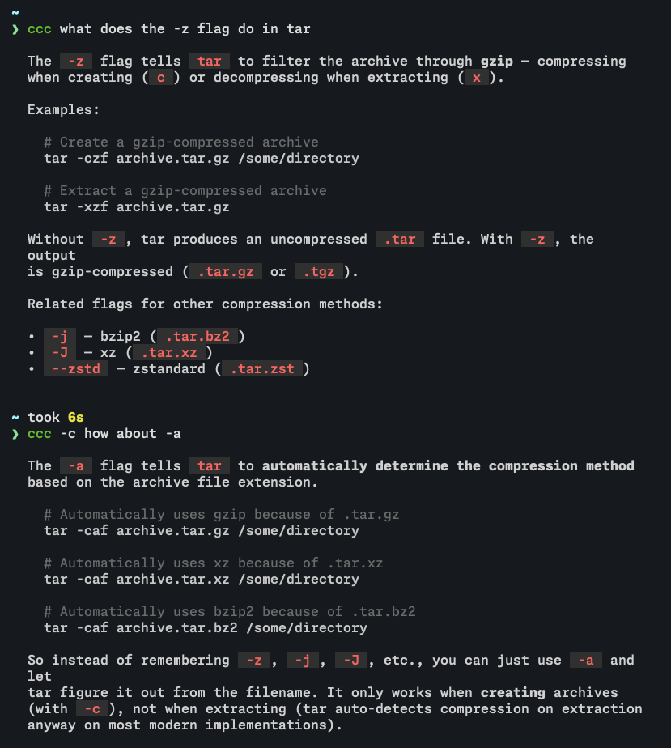

# ccc

Quick questions for Claude, right from your terminal.

```bash
ccc "what does the -z flag do in tar"
```



## Install

### Homebrew

```bash
brew install sadjad/tap/ccc
```

### Manual

```bash
git clone https://github.com/sadjad/ccc.git
ln -s "$(pwd)/ccc/ccc" /usr/local/bin/ccc
```

### Dependencies

- [Claude Code](https://claude.ai/claude-code) (`claude`) — **required**
- [gum](https://github.com/charmbracelet/gum) (`brew install gum`) — optional, spinner + styled input
- [glow](https://github.com/charmbracelet/glow) (`brew install glow`) — optional, markdown rendering

## Usage

```bash
# Ask anything (quotes are optional)
ccc what is the best way to handle errors in Go
ccc "what does the -z flag do in tar"

# Interactive mode: just run ccc with no prompt
# Follow-ups automatically continue the conversation
ccc
# ccc> what is rust?
# ccc> tell me more about ownership

# Pass files as context
ccc -f main.py "explain this"
ccc -f src/auth.ts -f src/db.ts "how do these interact"

# Pipe in code, diffs, logs
git diff | ccc review this
cat main.py | ccc explain this

# Pick a model (default: opus)
ccc --model haiku what is 2+2

# Give Claude access to a directory
ccc --dir ./src explain the architecture

# Copy output to clipboard
ccc --yank write a bash one-liner to find large files

# Continue a previous conversation
ccc what is rust
ccc --continue what about ownership
```

### Options

| Short | Long | Description |
|-------|------|-------------|
| `-c` | `--continue` | Continue the most recent conversation |
| `-f` | `--file <file>` | Add file contents to the prompt (repeatable) |
| `-m` | `--model <model>` | Model to use (default: opus) |
| `-s` | `--system <text>` | Override the default system prompt |
|       | `--no-system` | Use Claude Code's default system prompt instead |
| `-d` | `--dir <dir>` | Add directory context for file access |
| `-n` | `--no-save` | Don't save session (cannot be continued) |
| `-w` | `--write` | Use multi-line editor for interactive input |
| `-y` | `--yank` | Copy raw output to clipboard |
| `-h` | `--help` | Show help message |
| `-v` | `--version` | Show version |

Long options that take a value also accept `=` syntax (e.g., `--model=haiku`).

### Config file

ccc reads persistent defaults from `${XDG_CONFIG_HOME:-~/.config}/ccc/config`.
Simple `key=value` format; lines starting with `#` are comments. Command-line
flags override config values.

Example:

```ini
# Default model
model=haiku

# Custom system prompt
system=Be brief.

# Disable session isolation (use default ~/.claude)
# isolation=off
```

Supported keys:

| Key | Description |
|-----|-------------|
| `model` | Default model (e.g. `haiku`, `sonnet`, `opus`) |
| `system` | Default system prompt |
| `isolation` | `on` (default) or `off` — disable session isolation |

### Session isolation

ccc sets `CLAUDE_CONFIG_DIR` to `${XDG_DATA_HOME:-~/.local/share}/ccc` so its
sessions are fully isolated from your regular Claude Code sessions and don't
appear in `claude --resume`.

On first run, ccc will prompt you to authenticate for the isolated config
directory. You can disable isolation entirely by setting `isolation=off` in your
[config file](#config-file).

## License

MIT
